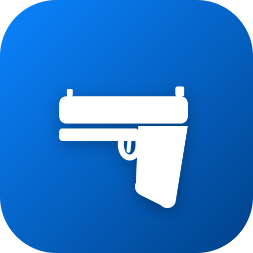

<p align="center">
  
</p>

<h1 align="center">IPSC Score</h1>

<p align="center">
  <strong>Hit Factor Calculator & Chrono Check per il Tiro Dinamico Sportivo</strong>
</p>

<p align="center">
  <a href="https://github.com/nicolocarello/IPSC/actions"></a>
  <a href="https://github.com/nicolocarello/IPSC/releases"></a>
  <a href="https://github.com/nicolocarello/IPSC/blob/main/LICENSE"></a>
  <a href="https://github.com/nicolocarello/IPSC/stargazers"></a>
  
</p>

<p align="center">
  <a href="#-funzionalita">Funzionalita</a> &bull;
  <a href="#-demo">Demo</a> &bull;
  <a href="#-installazione">Installazione</a> &bull;
  <a href="#-tecnologie">Tecnologie</a> &bull;
  <a href="#-struttura-progetto">Struttura</a> &bull;
  <a href="#-contribuire">Contribuire</a> &bull;
  <a href="#-licenza">Licenza</a>
</p>

---

## Cos'e IPSC Score?

**IPSC Score** e una Progressive Web App (PWA) progettata per tiratori sportivi, arbitri e appassionati di **Tiro Dinamico Sportivo (IPSC/FITDS)**. L'app offre due strumenti professionali in un'interfaccia moderna e intuitiva, utilizzabile su qualsiasi dispositivo, anche offline.

> *"Diligentia, Vis, Celeritas"* — Precisione, Potenza, Velocita. Il motto IPSC che guida ogni calcolo.

---

## Funzionalita

### Score Calculator — Hit Factor

Il calcolatore di Hit Factor per lo stage scoring IPSC:

- **Contatori Hits** — Conta i colpi Alpha (A), Charlie (C) e Delta (D) con pulsanti +/- tattili
- **Contatori Penalita** — Miss (M), No-Shoot (NS) e Procedural con sottrazione automatica di 10 punti ciascuno
- **Toggle Major/Minor** — Cambia il Power Factor dichiarato per adattare i punteggi di C e D
- **Input Tempo** — Inserisci il tempo dello stage in secondi per il calcolo dell'Hit Factor
- **Calcolo in tempo reale** — Hit Factor = (Punti Totali - Penalita) / Tempo
- **Punteggio minimo a zero** — Le penalita non portano mai il punteggio sotto zero

| Zona | Major | Minor |
|------|-------|-------|
| Alpha (A) | 5 pti | 5 pti |
| Charlie (C) | 4 pti | 3 pti |
| Delta (D) | 2 pti | 1 pto |
| Miss / NS / Proc | -10 pti | -10 pti |

### Chrono Check — Controllo Power Factor Arbitrale

Strumento per gli **arbitri di gara** che effettuano il controllo cronografico a campione sulle munizioni dei tiratori, seguendo fedelmente la **Regola IPSC 5.6.3** (Edizione Gennaio 2026):

- **Procedura a 3 step** che rispecchia esattamente il regolamento ufficiale:
  1. **Test Iniziale (Reg. 5.6.3.3)** — 3 colpi sparati al cronografo, PF calcolato con media delle 3 velocita
  2. **Retest (Reg. 5.6.3.6)** — Se il test 1 fallisce, 3 colpi aggiuntivi; PF ricalcolato con la media delle 3 velocita piu alte su 6
  3. **Ultima Chance (Reg. 5.6.3.7)** — Se ancora insufficiente, il tiratore puo far sparare il 7deg colpo (media best 3 su 7) oppure far pesare una 2deg palla
- **Gauge SVG animato** — Indicatore semicircolare con zone colorate (rosso/arancione/verde) e ago in tempo reale
- **Troncamento corretto** — Il PF viene troncato senza arrotondamento come da regolamento (124.999 = 124)
- **Evidenziazione Top 3** — Le 3 velocita piu alte vengono evidenziate visivamente durante il retest
- **Input peso palla** — Supporta sia il peso della 1deg palla (obbligatorio) che della 2deg (opzionale, Reg. 5.6.3.7a)
- **Soglie IPSC** — Major >= 170, Major Open 9mm >= 160, Minor >= 125

### Manuale Tecnico Integrato

L'app include un riferimento completo alle regole IPSC/FITDS consultabile offline:

- **Sicurezza & DQ** — Violazioni dei 180 gradi, sweeping, dropped gun
- **Divisioni** — Standard, Production, Open con specifiche tecniche
- **Equipaggiamento** — Regola dei 50mm, posizione fondina, ritenzione
- **Target & Punti** — Tabelle punteggio, procedurali speciali, no-shoot
- **Procedure & RO** — Comandi ufficiali ("Make Ready", "Standby", "Stop!")
- **Download PDF** — Regolamenti ufficiali IPSC 2026 e FITDS 2024-2025

### Design & UX

- **Glassmorphism iOS-style** — Interfaccia elegante con backdrop blur e trasparenze
- **Dark/Light Mode** — Tema automatico (segue il sistema) con override manuale
- **Responsive** — Layout a 2 colonne su desktop, colonna singola ottimizzata su mobile
- **Bottom Bar mobile** — Barra fissa con Hit Factor sempre visibile
- **PWA installabile** — Funziona come app nativa su iOS, Android e desktop
- **Offline-first** — Service Worker con precaching per funzionamento senza rete
- **Animazioni fluide** — Transizioni CSS e SVG con cubic-bezier personalizzati

---

## Demo

L'app e deployata e utilizzabile online:

**[ipsc.nicolocarello.it](https://ipsc.nicolocarello.it)**

Oppure puoi installarla come PWA direttamente dal browser (Safari su iOS, Chrome su Android/Desktop).

---

## Installazione

### Prerequisiti

- [Node.js](https://nodejs.org/) >= 18.0
- [npm](https://www.npmjs.com/) >= 9.0 (incluso con Node.js)

### Setup locale

```bash
# Clona la repository
git clone https://github.com/nicolocarello/IPSC.git
cd IPSC

# Installa le dipendenze
npm install

# Avvia il server di sviluppo
npm run dev
```

L'app sara disponibile su `http://localhost:5173/`.

### Comandi disponibili

| Comando | Descrizione |
|---------|-------------|
| `npm run dev` | Avvia il server di sviluppo Vite con HMR |
| `npm run build` | Crea la build di produzione in `dist/` |
| `npm run preview` | Anteprima locale della build di produzione |
| `npm run lint` | Esegue ESLint su tutti i file sorgente |

### Deploy

La build di produzione genera file statici in `dist/` deployabili su qualsiasi hosting statico:

```bash
npm run build
```

Piattaforme consigliate: **Cloudflare Pages**, Vercel, Netlify, GitHub Pages.

---

## Tecnologie

| Tecnologia | Versione | Utilizzo |
|-----------|----------|----------|
| [React](https://react.dev/) | 19.x | UI component library |
| [Vite](https://vite.dev/) | 8.x | Build tool & dev server |
| [Lucide React](https://lucide.dev/) | 1.7.x | Sistema di icone SVG |
| [vite-plugin-pwa](https://vite-pwa-org.netlify.app/) | 1.2.x | Progressive Web App (Service Worker, Manifest) |
| [ESLint](https://eslint.org/) | 9.x | Linting e code quality |

### Perche queste scelte?

- **React 19** — Ultima versione stabile con rendering ottimizzato e Concurrent Features
- **Vite 8** — Build istantanee, HMR sub-secondo, tree-shaking nativo con Rollup
- **Zero CSS framework** — Styling custom con CSS Variables per massima leggerezza (~8 KB CSS totale)
- **Lucide** — Icone SVG ottimizzate, tree-shakeable (solo le icone usate finiscono nel bundle)
- **PWA nativa** — Service Worker generato automaticamente, nessuna dipendenza aggiuntiva runtime

---

## Struttura Progetto

```
IPSC/
├── public/
│   ├── icon.svg                    # App icon (PWA + favicon)
│   └── regolamenti/                # PDF regolamenti ufficiali
│       ├── IPSC-Handgun-Competition-Rules-Jan-2026-Edition-Final.pdf
│       ├── HandgunRegolamentoGennaio2024VersioneFinale.pdf
│       ├── Regolamento_Sportivo_2025_v_22.10.24.pdf
│       └── Appendici_2025_con_quote.pdf
│
├── src/
│   ├── main.jsx                    # Entry point React DOM
│   ├── App.jsx                     # Componente principale, routing tab, modals
│   ├── index.css                   # Design system completo (variabili, layout, animazioni)
│   │
│   ├── components/
│   │   ├── HitCounter.jsx          # Contatore +/- riutilizzabile per hits/penalties
│   │   ├── ChronoCheck.jsx         # Chrono Check arbitrale (gauge + procedura 3-step)
│   │   └── Modal.jsx               # Wrapper modale glassmorphic riutilizzabile
│   │
│   └── utils/
│       └── scoring.js              # Logica calcolo Hit Factor IPSC
│
├── .github/
│   ├── workflows/
│   │   └── ci.yml                  # CI: lint + build
│   ├── ISSUE_TEMPLATE/
│   │   ├── bug_report.md           # Template segnalazione bug
│   │   └── feature_request.md      # Template richiesta funzionalita
│   └── PULL_REQUEST_TEMPLATE.md    # Template pull request
│
├── index.html                      # HTML entry point
├── vite.config.js                  # Configurazione Vite + PWA
├── eslint.config.js                # Configurazione ESLint 9 flat config
├── package.json                    # Dipendenze e scripts
├── LICENSE                         # Licenza MIT
├── CONTRIBUTING.md                 # Guida per i contributori
├── CODE_OF_CONDUCT.md              # Codice di condotta
├── CHANGELOG.md                    # Storico versioni
├── SECURITY.md                     # Policy di sicurezza
└── README.md                       # Questo file
```

---

## Riferimenti Regolamentari

L'app implementa fedelmente le seguenti regole IPSC/FITDS:

| Regola | Edizione | Contenuto |
|--------|----------|-----------|
| **5.6.3** | IPSC Handgun Jan 2026 | Procedura completa Chronograph Testing |
| **5.6.3.2** | IPSC Handgun Jan 2026 | Prelievo 8 cartucce campione |
| **5.6.3.3** | IPSC Handgun Jan 2026 | Pesatura palla + 3 colpi cronografo |
| **5.6.3.5** | IPSC Handgun Jan 2026 | Formula PF con troncamento decimali |
| **5.6.3.6** | IPSC Handgun Jan 2026 | Retest: best 3 su 6 velocita |
| **5.6.3.7** | IPSC Handgun Jan 2026 | Ultima chance: 7deg colpo o 2deg palla |
| **Cap. 9** | IPSC Handgun Jan 2026 | Scoring & Hit Factor |
| **Cap. 10** | IPSC Handgun Jan 2026 | Sicurezza e Match DQ |
| **App. D1-D5** | IPSC Handgun Jan 2026 | Specifiche Divisioni |

---

## Contribuire

Le contribuzioni sono benvenute! Leggi la [Guida per i Contributori](CONTRIBUTING.md) per i dettagli su come proporre modifiche, segnalare bug o richiedere nuove funzionalita.

Questo progetto adotta un [Codice di Condotta](CODE_OF_CONDUCT.md) che tutti i partecipanti sono tenuti a rispettare.

---

## Licenza

Questo progetto e distribuito sotto licenza **MIT**. Vedi il file [LICENSE](LICENSE) per il testo completo.

```
MIT License - Copyright (c) 2025 Nicolo Carello
```

---

## Autore

**Nicolo Carello** — [nicolocarello.it](https://nicolocarello.it) — [GitHub](https://github.com/nicolocarello)

---

<p align="center">
  <sub>Costruito con React, Vite e passione per il Tiro Dinamico Sportivo.</sub><br/>
  <sub>Se trovi utile questo progetto, lascia una stella sul repository.</sub>
</p>
